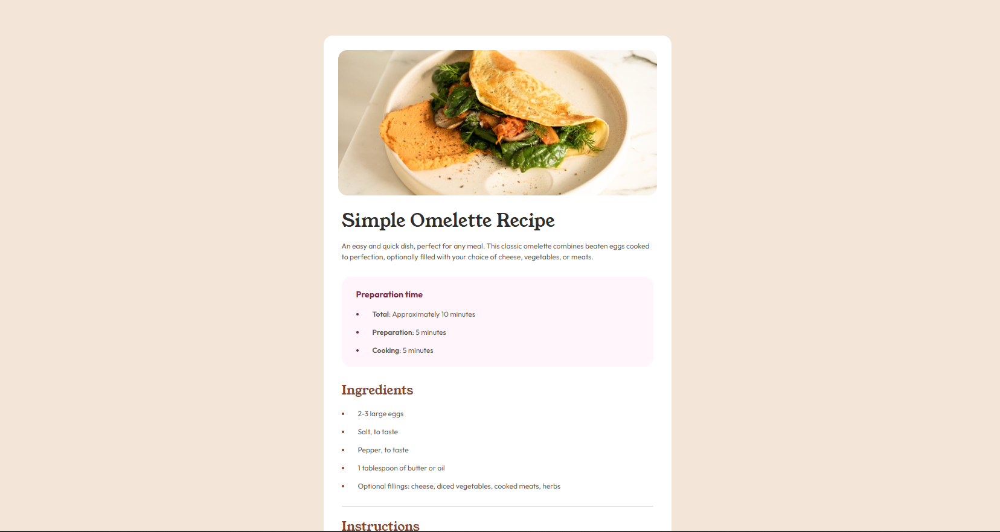

# Frontend Mentor - Recipe page solution

This is a solution to the [Recipe page challenge on Frontend Mentor](https://www.frontendmentor.io/challenges/recipe-page-KiTsR8QQKm). Frontend Mentor challenges help you improve your coding skills by building realistic projects. 

## Screenshot

## Built with

- Semantic HTML5 markup
- Mobile-first workflow

## Links

- [Solution page](https://www.frontendmentor.io/solutions/recipe-page-with-basic-htmland-css-ORAiIfaqZf)
- [Live site](https://risaysky.github.io/Frontend-Mentor---Recipe-page/)
